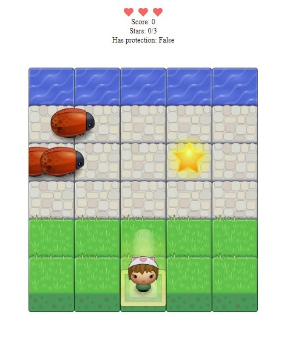

# Classic Arcade Game Clone Project

This is a simple arcade game built using JavaScipt

## How to play
First you have to chose your character before starting the game.

Then use the arrow keys **UP**, **DOWN**, **LEFT** and **RIGHT** to move the character

You have three lives during your game, each time an enemy hits you, you'll lose one live and once you got 0 lives your game will over

Your mission is to collect the **3 stars** and reach the sea the increments your score

Each time your score increments there's a change to get a supply 

There are four type of supplies: 
* `The Blue Gem:` makes you invisible for 3 seconds from the time an enemy hits you.
* `The Green Gem:` Freeze all the enemies for 3 seconds once you collect it. 
* `The Orange Gem:` Will increments your stars up to three, so once you collect it you just need to get to the sea.
* `The Heart:`  Will increments you lives.

**Note:**
>Your high score at the end of the game will always be stored.

## Credirs

_Font_: [Font Awesome](https://fontawesome.com/)

_Sound Effects_: [Freesound](https://freesound.org/)
